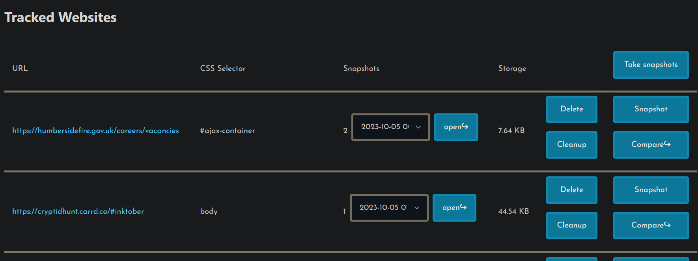

# Web differ

This project is a frontend for keeping track of static websites to see if they change.

<http://server.alifeee.co.uk:5616>



## Usage

### Install

```bash
python3 -m venv env
source env/bin/activate
pip install -r requirements.txt
playwright install
mkdir snapshots
echo "id,url,css_selector\n" > sites.csv
py ./server.py
```

Set up cron

```bash
crontab -e
```

Backup tracked websites, then run the differ to check for new content.

```bash
# Run every day
0 12 * * * /root/python/website-differ/backup.sh >> /root/python/website-differ/cron.log 2>&1
0 12 * * * /root/python/website-differ/rundiffer.sh >> /root/python/website-differ/cron.log 2>&1
```

## Development

### Set up virtual environment

```bash
py -m venv env
```

### Save dependencies

```bash
pip freeze > requirements.txt
```

## Notifications

Notifications are sent via Pushbullet. To set up Pushbullet via python, you need to set up an access token, found in the [user settings](https://www.pushbullet.com/#settings/account).
These are stored in a `.env` file.

```.env
PUSHBULLET_ACCESS_TOKEN=...
```

See more information on <https://pypi.org/project/pushbullet.py/0.9.1/>.
